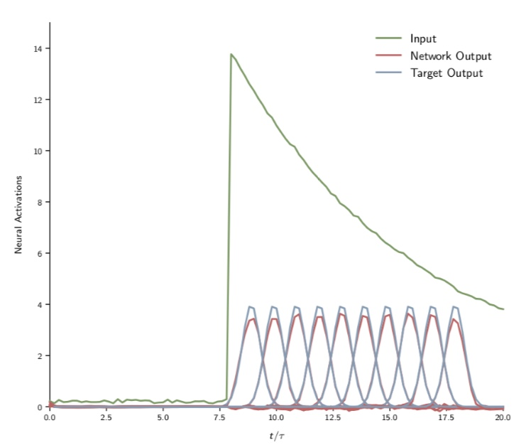

# Mitigating Catastrophic Forgetting in Biologically Constrained RNNs Using EWC(Elastic Weights Consolidation)

This was the subproject I did as part of our Project for our Machine Learning Class offered by Professor Rajesh Ranganath at NYU Courant. In the [Project Report](Machine_Learning_Project_Report-2.pdf),
only the sections on Catastrophic Forgetting are mine. The other sections are my Teammates'.

Here, the Biological RNN used is the the network used in [pycog](https://github.com/frsong/pycog). The base network is the same as the one I use in my Thesis, but unlike in the Thesis, almost no modifications and adaptations have been made to the network itself or the optimization algorithm. The only modifications are Implementing Dropout and adding a Regularization term to the Loss Function. The edited code is [here](trainer.py)

Instead of MNIST Digits, for the first task, the sequence of inputs given to the network is the product of a decaying exponential function and the sinusoidal function while the outputs for each time step are Gaussians with different means. For the second task the sequence of inputs is the product of an increasing exponential function(unlike a decreasing one as in the first task) with the sinusoidal function, but with different frequency and amplitude, while the outputs are the same as for the previous task but with their time order reversed. The two tasks are not only quite disparate from each other, because of the dimetrically opposite inputs and outputs between the tasks, being to able to learn the second task while also performing well on the first task is exceptionally challenging.

They are thus, both regression tasks and not classification tasks. Most importantly, though, the most crucial difference is the approach used to Mitigate forgetting. Here, I use a combination of two well known Regularization based approaches for Catastrophic Forgetting, that is, Dropout and Elastic WEights Consolidation(EWC). EWC involves adding a regularization term to the Loss function while training for the second task, as follows :

where F is the Fisher Information Matrix. The regularization term forces the new parameters to be in a bounded neighbourhood of the parameters learnt after training for the first task, for the parameters that were more important for learning the first task.

## Results:

### Performance on the First Task After Initial Training With Dropout:

### Performance on the First Task After Training for the Second Task with Dropout and EWC:

One can see that Catastrophic Forgetting still occurs, inspite of Dropout and EWC. This could be because of the biological constraints on the network or the degree of disparity between the tasks.

## Report:

[Report](Machine_Learning_Project_Report-2.pdf)

